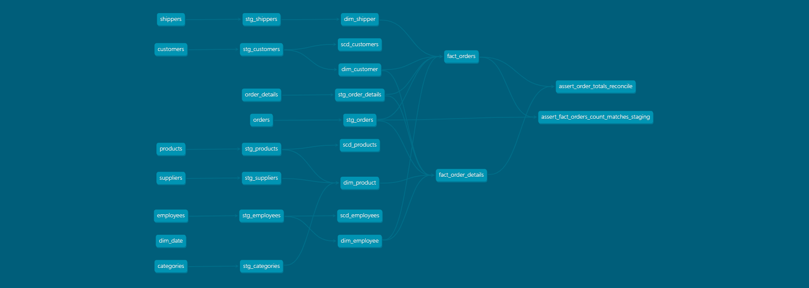
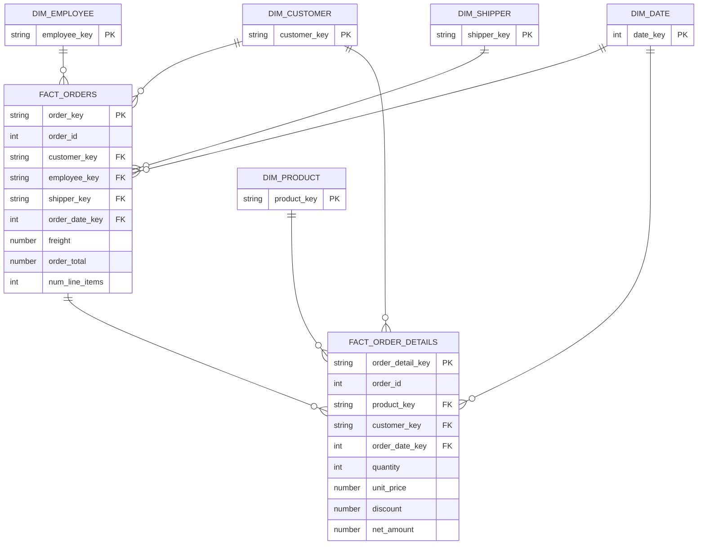

# 🏭 Northwind Data Warehouse — Modelado Dimensional con dbt + Snowflake

Proyecto de **ingeniería analítica** que transforma la base de datos transaccional *Northwind* en un **data warehouse dimensional** (esquema en estrella) listo para análisis de negocio, construido con **dbt** sobre **Snowflake**.

El objetivo es demostrar el ciclo completo de un proyecto de *analytics engineering*: ingesta de datos crudos, transformación por capas, modelado dimensional (Kimball), pruebas de calidad automatizadas e historización de dimensiones (SCD Tipo 2).

---

## 🎯 ¿Qué resuelve este proyecto?

La base *Northwind* está normalizada para operaciones (OLTP): consultar "los ingresos por categoría y trimestre" obliga a unir media docena de tablas. Este proyecto la reorganiza en un **modelo estrella** (OLAP) donde esa pregunta —y muchas otras de negocio— se responde con un `JOIN` simple entre un hecho y sus dimensiones.

**Preguntas de negocio que habilita:**
- Ingresos netos por categoría de producto y periodo
- Top de clientes por país e ingreso
- Rendimiento de ventas por comercial (empleado)
- Coste y tiempos de envío por transportista
- Impacto del descuento sobre el margen
- Estacionalidad de las ventas

---

## 🗺️ Arquitectura

El flujo sigue el patrón de capas estándar de dbt:

```
Seeds (raw)  →  Staging (vistas)  →  Marts (tablas: dims + facts)
                                          │
                                          └──→ Snapshots (SCD2)
```

- **Raw** — Los CSV de Northwind cargados como *seeds*. Hace el proyecto 100 % reproducible.
- **Staging** — Una vista por tabla de origen. Renombrado, casteo de tipos y limpieza ligera. Sin joins ni agregaciones.
- **Marts** — El modelo dimensional materializado como tablas para rendimiento en BI.
- **Snapshots** — Historización SCD2 de las dimensiones que cambian en el tiempo.

### Grafo de linaje

El DAG generado por `dbt docs`, de los *seeds* a los hechos y tests, con las dependencias resueltas automáticamente por dbt:



---

## ⭐ Modelo dimensional

Dos tablas de hechos a **distinto grano**, compartiendo **dimensiones conformadas**:



| Tabla | Tipo | Grano |
|---|---|---|
| `fact_orders` | Hecho | Un pedido |
| `fact_order_details` | Hecho | Una línea de pedido |
| `dim_customer` | Dimensión | Un cliente |
| `dim_product` | Dimensión | Un producto (con categoría y proveedor desnormalizados) |
| `dim_employee` | Dimensión | Un empleado |
| `dim_shipper` | Dimensión | Un transportista |
| `dim_date` | Dimensión | Un día (calendario generado) |

---

## 🧠 Decisiones de diseño

- **Dos granos de hechos.** `fact_order_details` (línea) guarda las medidas finas (cantidad, precio, descuento, `net_amount`); `fact_orders` (pedido) pre-agrega totales para consumo directo en BI. Un test de reconciliación valida que ambos granos cuadran entre sí.
- **Claves subrogadas.** Cada dimensión usa una `*_key` generada con `dbt_utils.generate_surrogate_key`, desacoplando el warehouse de las claves del origen y habilitando SCD2.
- **Dimensión degenerada.** `order_id` viaja en los hechos como identificador de negocio, sin tabla propia.
- **Desnormalización.** `dim_product` aplana producto + categoría + proveedor en una sola dimensión ancha (esencia del esquema en estrella).
- **`dim_date` con clave inteligente.** Formato `YYYYMMDD` (ej. `19960704`): estable, ordenable y calculable desde los hechos sin join.
- **Materializaciones.** Staging como vistas (frescura, cero almacenamiento); marts como tablas (rendimiento).
- **Casteo defensivo.** Las fechas opcionales (ej. envíos pendientes) se castean con protección de nulos para no romper la carga.

---

## ✅ Calidad de datos

**29 tests automatizados** (`dbt test`):

- **Genéricos**: `unique` y `not_null` en todas las claves; `relationships` (integridad referencial hecho ↔ dimensión); rangos aceptados (`net_amount ≥ 0`, `quantity ≥ 1`, `0 ≤ discount ≤ 1`).
- **Singulares (reglas de negocio)**:
  - Reconciliación de volumen: `fact_orders` no pierde ni duplica pedidos respecto al origen.
  - Reconciliación entre granos: el total de cada pedido coincide con la suma de sus líneas.

---

## 🕰️ Historización (SCD Tipo 2)

Los *snapshots* (`scd_customers`, `scd_employees`, `scd_products`) capturan los cambios de atributos en el tiempo con la estrategia `check`, añadiendo ventanas de validez (`dbt_valid_from` / `dbt_valid_to`). Esto permite responder *"¿cuál era el estado de esta dimensión cuando ocurrió el hecho?"*, algo imposible con una dimensión SCD Tipo 1.

---

## 🛠️ Stack

- **Snowflake** — Data warehouse en la nube
- **dbt Core** (`dbt-snowflake`) — Transformación, tests y documentación
- **dbt_utils** — Claves subrogadas, calendario y rangos
- **Python 3.12** — Entorno de ejecución
- **Datos**: Northwind (8 tablas de origen)

---

## 📂 Estructura del proyecto

```
northwind/
├── dbt_project.yml
├── packages.yml
├── models/
│   ├── staging/            # 8 modelos stg_ (vistas)
│   └── marts/
│       ├── _marts.yml      # tests y documentación
│       ├── dim_*.sql       # 5 dimensiones
│       └── fact_*.sql      # 2 hechos
├── seeds/                  # 8 CSV de Northwind (capa raw)
├── snapshots/
│   └── scd_dimensions.yml  # 3 snapshots SCD2
└── tests/                  # 2 tests singulares de reconciliación
```

---

## 🚀 Cómo ejecutarlo

Requiere una cuenta de Snowflake (sirve el *trial* gratuito) y Python 3.10–3.13.

```bash
# 1. Entorno
python -m venv .venv
source .venv/bin/activate        # Windows: .venv\Scripts\activate
pip install dbt-snowflake

# 2. Conexión: configura ~/.dbt/profiles.yml con tus credenciales de Snowflake
#    (account, user, password, role, warehouse, database, schema)

# 3. Dependencias y construcción
dbt deps          # instala dbt_utils
dbt seed          # carga los datos crudos
dbt run           # construye staging + dims + facts
dbt test          # ejecuta los 29 tests de calidad
dbt snapshot      # crea/actualiza el historial SCD2

# Alternativa: dbt build  (seed + run + test + snapshot en un solo comando)
```

Documentación interactiva con grafo de linaje:

```bash
dbt docs generate && dbt docs serve
```

---

## 🔭 Posibles mejoras

- Orquestación con Airflow / Dagster o dbt Cloud (snapshots programados)
- CI/CD con GitHub Actions (`dbt build` en cada *pull request*)
- Capa de *exposures* y conexión a un dashboard de BI
- Métricas con dbt Semantic Layer

---

## 👤 Autora

**Grecia Landazuri Herrera**
[LinkedIn](https://www.linkedin.com/in/grecialh/) · [GitHub](https://github.com/GreciaLH)
